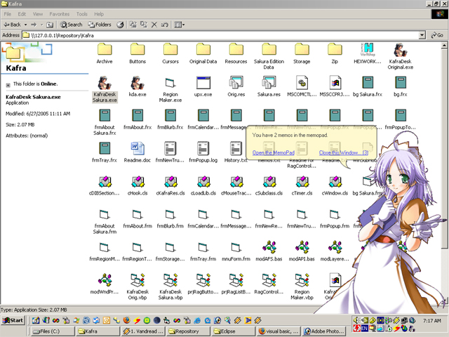



## Ragnarok Themed Kafra Desktop Assistant

### Description

This project started as a way to play around with form shaping. It then extended into custom graphical blitted controls and subclassing.

This is intended as a desktop companion, where you can store random thoughts or memos. You can also drag files onto it to move them into a storage folder.

This is a fan work heavily inspired by Ragnarok, so if you're not into ragnarok online, you probably won't find much use for this.

Shows form shaping using regions stored in a resource, subclassing to limit form movement, snapping a form to the edges of the screen, custom drawn controls.
 
### More Info
 
When running the code in the IDE, make sure to exit the code by right clicking the kafra and choosing Close. The app will crash if it is stopped via the IDE.

             |
---                |---
**Submitted On**   |2005-06-28 09:03:50
**By**             |[David Santos](https://github.com/Planet-Source-Code/PSCIndex/blob/master/ByAuthor/david-santos.md)
**Level**          |Advanced
**User Rating**    |5.0 (40 globes from 8 users)
**Compatibility**  |VB 5\.0, VB 6\.0
**Category**       |[Miscellaneous](https://github.com/Planet-Source-Code/PSCIndex/blob/master/ByCategory/miscellaneous__1-1.md)
**World**          |[Visual Basic](https://github.com/Planet-Source-Code/PSCIndex/blob/master/ByWorld/visual-basic.md)
**Archive File**   |[Ragnarok\_T1906136272005\.zip](https://github.com/Planet-Source-Code/david-santos-ragnarok-themed-kafra-desktop-assistant__1-61365/archive/master.zip)

